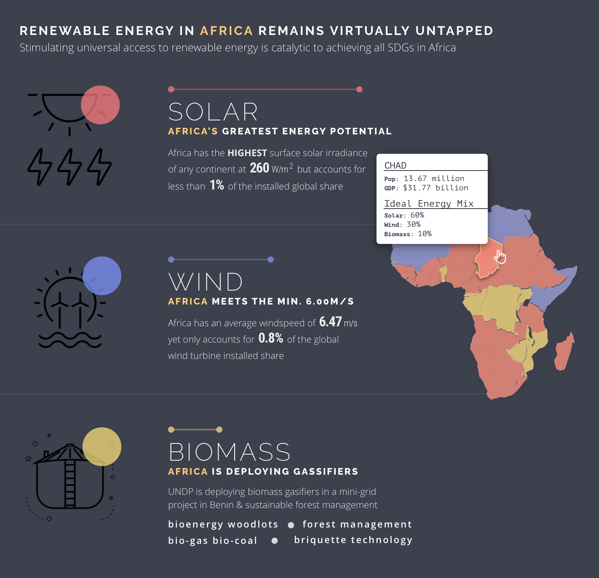

### Justification for Design Decisions 👌🏻

1.  Content:
    - There's a story to be told on this entire ii page that isn't being told effectively. By re-imagining flow to be PROBLEM => SOLUTION => METHODS, I decided to tackle the SOLUTION section, which includes the three potential renewable sources of energy.
    - I mainained the print graphic format – although there's no reason this couldn't exist as a digital graphic as well (as it is now). Additional interactivity would also be possible – see the link at the bottom for an early concept.
2.  Layout:
    - Rule of threes. Take advantage anytime you're dealing with three of something. Here we have three renewable energy resources and they should all be contained in the same section.
    - Take advantage of natural vertical rhythm and stack the three sources on top of each other with very thin dividers to separate each source but still appear related.
    - Consolidate the graphics and only show 1 map of Africa that still communicates the same messages. Less is more.
    - The use of the iconography/watermarks provides a visually trigger to the type of unique energy described in that section. Its opacities are reduced so it doesn't take away from the content but still does its job.
3.  Color:
    - First, I decided to use a "night mode" concept that's aesthetically popular right now. There's not much reason to choose light vs. dark background but conisdering my typographic alpha values (explained below), many times white text on dark background is more readable with high contrast
    - Used the HSB method to choose a palette. I wanted a color coordinated system to distinguish between solar, wind, and biomass. Because of this, changing the hue is critical to create distinct content. In order to make the feel and tone similar with different colors, all colors have the same Saturation and Brightness values.
    - In addition to the color on the icon and section content, the map of Africa suggests where that energy source has the most potential by coloring the map with that same system. This method helps eliminate the additional maps and allows for consolidation and comparision between the energy sources.
    - The yellow color serves as an accent color to keep pushing the "Africa" message.
4.  Typography:
    - LEFT ALIGNED!!!! One of the most egregious mistakes of the current graphic is the use of every kind of alignment to cause chaos instead of intended contrast all over the page. The reader has no idea where to look next. Always start with left aligned text and adjust if necessary. All of my copy is left aligned in this entire section.
    - In order to create contrast and visual seperation between the different content, I played around with weight, value, font type, size, leading, and tracking. I chose Raleway for the headers that has a nice futuristic feel in thin weights and Open Sans for the body copy as it is highly legible, especially at smaller sizes. Additionally, the metrics use a Roboto Condensed font to stand out but still fit within the family.
    - All text is white except the "Africa yellow". I only adjusted the value of the text for emphasis and contrast - this helps by keeping the color pallete small but getting the benefit of different "colors" through value in text.

---

Next Steps

- If I were to take this farther, I might experiment with typography a little more, especially with the sections themselves. How to better show the statistics and data?
- Interactivity: I started playing around with what else would be possible if this graphic lived on the web and how users could interact with the map. See this example to show what happens when hovering over a country to see its tooltip.

