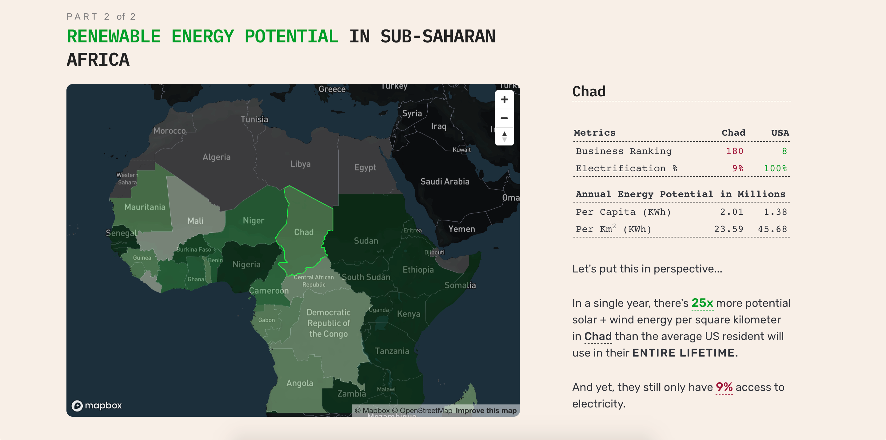

# How can acting on renewable energy potential improve the ease of doing business in Sub-Saharan Africa?

One of the biggest obstacles to effectively growing an economy is a lack of access to affordable electricity. Unfortunately, Sub-Saharan Africa has some of the harshest economic and electrification conditions in the world. Luckily, there's an opportunity; in many of these countries, there's some of the highest renewable energy potential in the entire world. This visual essay explores current economic conditions and potential energy opportunities in Sub-Saharan Africa.

---

